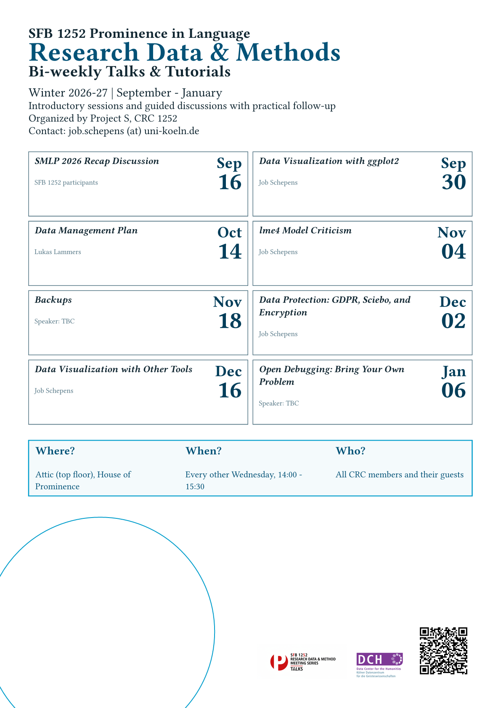

# Research Data & Methods - Winter Semester 2026-27 Schedule

**Series Information:**

- **When:** Every second Wednesday, 14:00 - 15:30
- **Where:** House of Prominence, Attic (Top floor), Luxemburger Str. 299
- **Format:** Introductory session or guided discussion with practical follow-up
- **Organizers:** Project S, CRC 1252

## Subscribe to Calendar

Add the current schedule to your calendar:

- **[Download iCal file](winter-2026-27.ics)** - Import into Outlook, Apple Calendar, Thunderbird, and other calendar apps

## Flyer

{ width="400" data-gallery="flyers" }

- **[Download flyer PDF](../flyers/2026_rdm-flyer_winter-semester/2026-09-07_rdm-winter-2026-27-flyer.pdf)**

## Workshop Schedule

### 26. [SMLP 2026 Recap Discussion](../workshops/26-smlp2026-recap/index.md)

**Date:** 16 September 2026
**Time:** 14:00 - 15:30
**Speakers:** SFB 1252 participants

**Focus:**

- Recap and exchange on SMLP 2026
- Discussion of methods and insights relevant for CRC projects
- Collecting follow-up resources and practical next steps

**Primary Resource:**

- [SMLP 2026 Website](https://vasishth.github.io/smlp2026/)

---

### 27. Data Visualization with ggplot2
**Date:** 30 September 2026
**Time:** 14:00 - 15:30
**Speaker:** Job Schepens
**Focus:** Core ggplot2 grammar, clean figure design, plotting mistakes, uncertainty, model-based plots, publication-ready figures

### 28. Data Management Plan

**Date:** 14 October 2026
**Time:** 14:00 - 15:30
**Speaker:** Lukas Lammers
**Focus:** Creating practical, funder-aligned data management plans for research projects, including documentation, storage, sharing, and archiving

### 29. lme4 Model Criticism

**Date:** 4 November 2026
**Time:** 14:00 - 15:30
**Speaker:** Job Schepens
**Focus:** Diagnostics, assumptions, model comparison, and robust interpretation for lme4 models

### 30. Backups

**Date:** 18 November 2026
**Time:** 14:00 - 15:30
**Speaker:** TBC
**Focus:** Practical backup plans, versioned snapshots, restore testing, and routine automation

### 31. Data Protection: GDPR, Sciebo, and Encryption

**Date:** 2 December 2026
**Time:** 14:00 - 15:30
**Speaker:** Job Schepens
**Focus:** Handling sensitive data with GDPR-aligned workflows, secure sharing via Sciebo, and encryption basics

### 32. Data Visualization with Other Tools

**Date:** 16 December 2026
**Time:** 14:00 - 15:30
**Speaker:** Job Schepens
**Focus:** Introduction to alternative data visualization tools and their applications in research

### 33. Open Debugging: Bring Your Own Problem

**Date:** 6 January 2027
**Time:** 14:00 - 15:30
**Speaker:** TBC
**Focus:** Collaborative troubleshooting across R, Python, Git, and document workflows
