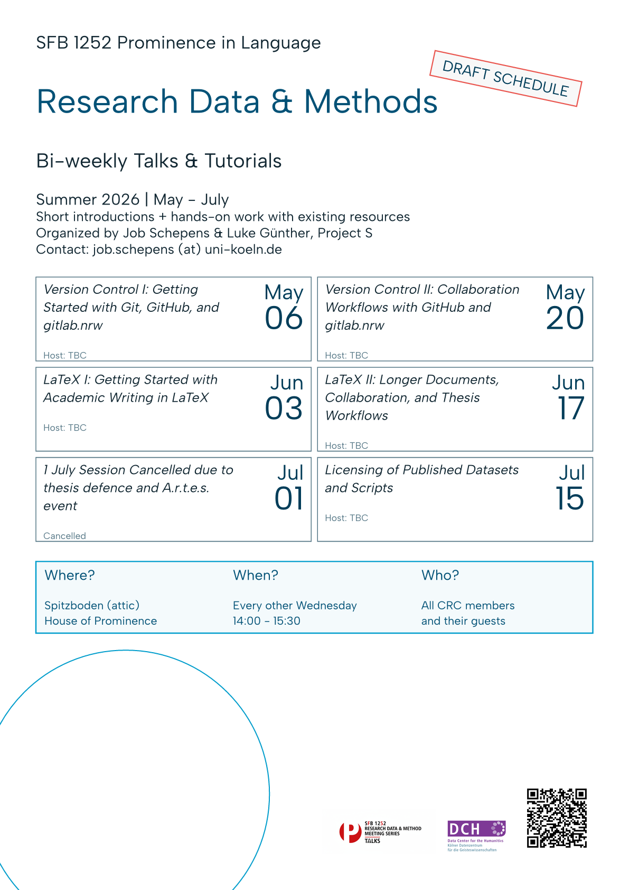

# Research Data and Methods Workshop Series

Workshop series by CRC 1252 - Prominence in Language at the University of Cologne.

Workshops on research methodology, data management, and academic practices for graduate students, postdocs, and researchers.

---

## Next Upcoming Session

  
Looking up the next session...

---

  
<strong>Next schedule:</strong> See the <a href="agenda/winter-2026-27-schedule/">Winter 2026-27 schedule</a>.

  
<strong>Summer 2026 archive:</strong> See the <a href="agenda/summer-2026-schedule/">Summer 2026 schedule</a> for completed workshop dates and materials.

  
<strong>Winter 2025-26 archive:</strong> See the <a href="agenda/winter-2025-26-schedule/">Winter 2025-26 archive</a> for completed workshop dates and materials.

  
<strong>Summer 2025 archive:</strong> See the <a href="agenda/summer-2025-schedule/">Summer 2025 archive</a> for completed workshop dates and materials.

---

## Possible Future Topics

Topics we may look at in future workshops, reading groups, or practical
sessions:

### Tools & Workflows

- Basic introductions to LaTeX, GitHub, Python, R, AI assistance, annotation tools etc.
- R Markdown / Quarto for documents, presentations, `reveal.js`, and `pandoc`
- Collaborative writing, version control, and workflow / pipeline design
- Open source alternatives to closed-source software, applications, and online services

### Data, Annotation & Research Practice

- Research data management
- Data archives, data sharing, and NFDI
- Introduction to multimedia annotation tools such as ELAN, Praat, and Inception
- Backups, data protection, privacy, encryption, and scheduled backups
- Quality assessment and metadata validation

### Statistics & Data Analysis

- Basic introductions to statistics such as significance testing and regression modeling
- GAMs
- Statistics best practices
- Data analysis sessions using participants' own data

### Open Research & Publishing

- Open science, open access, open source, and open data
- Dissemination, preprints, repositories, FAIR practices, metadata, and licenses

### AI & Current Methods

- AI in linguistics and scientific workflows, including best practices for using generative AI assistants
- Open science practices in LLMs and current AI technology

### Alternative Formats

- Reading group sessions
- Presentations of work in progress

---

## Workshop Flyers

### Current Flyer

{ width="520" data-gallery="flyers" }

**Winter 2026-27 Flyer** - [Download PDF](flyers/2026_rdm-flyer_winter-semester/2026-09-07_rdm-winter-2026-27-flyer.pdf)

### Archived Flyers

Previous promotional materials:

-   <figure markdown="span">
      { width="400" data-gallery="flyers" }
      <figcaption>Summer 2025 Flyer - <a href="flyers/2025_rdm-flyer_summer-semester/2025-05-08_rdm-summer-flyer.pdf">Download PDF</a></figcaption>
    </figure>

-   <figure markdown="span">
      { width="400" data-gallery="flyers" }
      <figcaption>Winter 2025-26 Flyer - <a href="flyers/2025_rdm-flyer_winter-semester/2025-08-25_rdm-winter-flyer.pdf">Download PDF</a></figcaption>
    </figure>

-   <figure markdown="span">
      { width="400" data-gallery="flyers" }
      <figcaption>Winter 2025-26 Flyer Part 2 - <a href="flyers/2025_rdm-flyer_winter-semester/2025-12-03_rdm-winter-flyer.pdf">Download PDF</a></figcaption>
    </figure>

-   <figure markdown="span">
      { width="400" data-gallery="flyers" }
      <figcaption>Summer 2026 Flyer - <a href="flyers/2026_rdm-flyer_summer-semester/2026-04-16_rdm-summer-2026-flyer.pdf">Download PDF</a></figcaption>
    </figure>

---

## Additional Information

- **Getting Started:** [Onboarding materials](resources/onboarding/README.md) for new CRC 1252 members
- **Contributing:** See our [contributing guide](about/contributing.md) to contribute materials
- **Resources:** [Additional resources](resources/additional-links/additional-links.md) for research support

---

_CRC 1252 "Prominence in Language" research initiative, University of Cologne._
