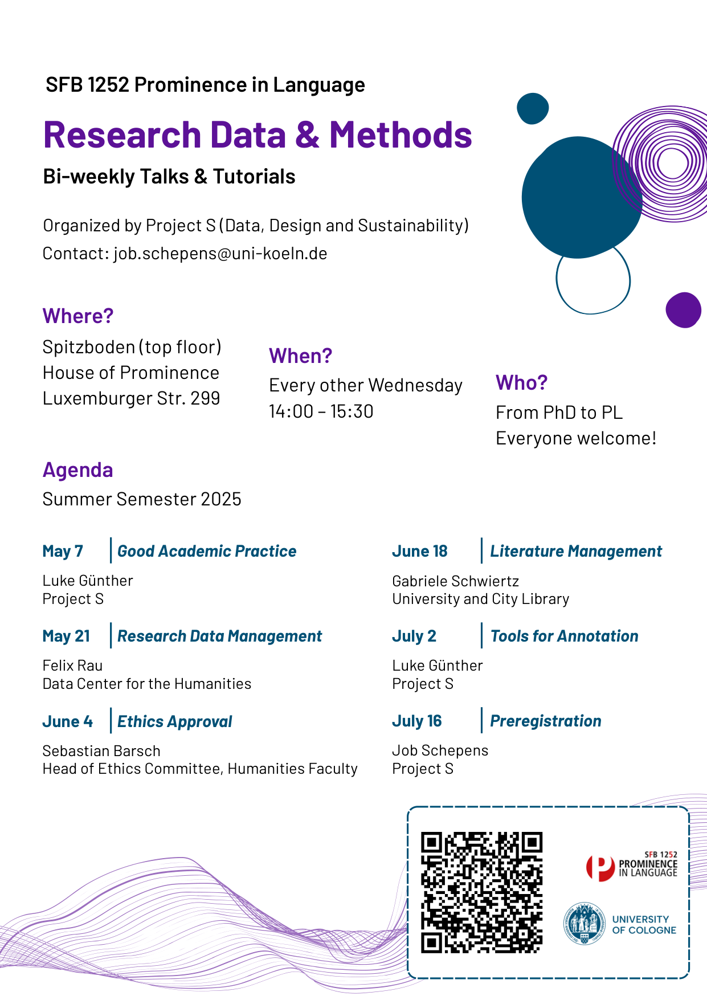
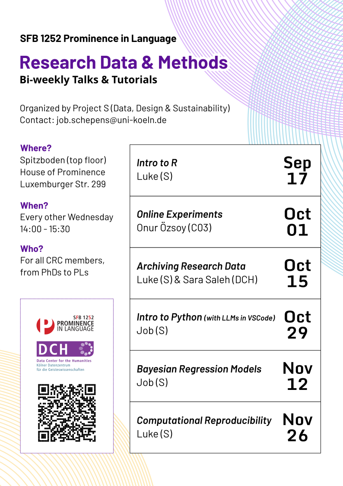
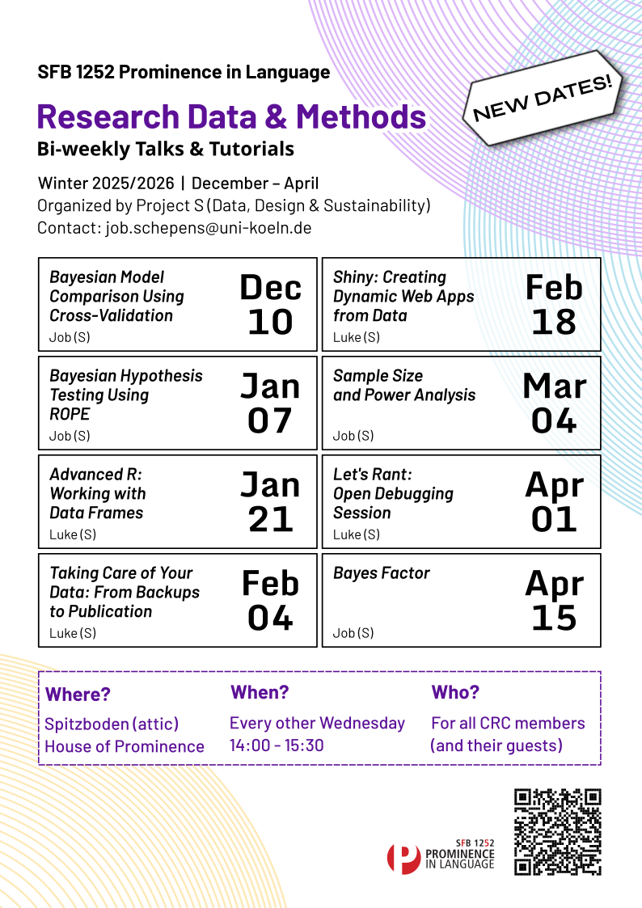

# Research Data and Methods Workshop Series

Workshop series by CRC 1252 - Prominence in Language at the University of Cologne.

Workshops on research methodology, data management, and academic practices for graduate students, postdocs, and researchers.

---

## Available Workshops

1. **[Good Academic Practice](workshops/01-good-academic-practice/index.md)** (7 May 2025) - Academic integrity, research ethics, and responsible conduct
2. **[Research Data Management](workshops/02-research-data-management/index.md)** (21 May 2025) - Organizing, storing, and preserving research data
3. **[Ethics Approval](workshops/03-ethics-approval/index.md)** (4 June 2025) - Ethics approval process and human subjects research requirements
4. **[Literature Management](workshops/04-literature-management/index.md)** (18 June 2025) - Reference management tools (Zotero) and citation techniques
5. **[Annotation & Corpus Tools](workshops/05-annotation-corpus-tools/index.md)** (2 July 2025) - Tools for corpus linguistics and text annotation
6. **[Preregistration](workshops/06-preregistration/index.md)** (16 July 2025) - Preregistering research studies for transparency and reproducibility
7. **[Coding in R - Basics](workshops/07-coding-r-basics/index.md)** (17 September 2025) - Introduction to R programming for research applications
8. **[Online Experiments](workshops/08-online-experiments/index.md)** (1 October 2025) - Designing and implementing online experiments
9. **[Archiving Session](workshops/09-archiving-session/index.md)** (15 October 2025) - Long-term data preservation, standards, and UoC repository usage
10. **[Coding in Python/VSCode and LLMs](workshops/10-coding-python-vscode-llms/index.md)** (29 October 2025) - Python setup, core libraries, Git integration, and LLM-assisted coding
11. **[Bayesian Regression Models](workshops/11-bayesian-regression-models/index.md)** (12 November 2025) - Bayesian regression in R with priors, checking, and interpretation
12. **[Computational Reproducibility using R](workshops/12-computational-reproducibility-r/index.md)** (26 November 2025) - Reproducible workflows with R Markdown/Quarto, renv, and pipelines
13. **[Bayesian Model Comparison Using Cross-Validation](workshops/13-bayesian-model-comparison-cv/index.md)** (17 December 2025) - Comparing Bayesian models using cross-validation techniques
14. **[Bayesian Hypothesis Testing Using ROPE](workshops/14-bayesian-rope-testing/index.md)** (7 January 2026) - Bayesian hypothesis testing with the Region of Practical Equivalence (ROPE)
15. **[Advanced R: Working with Data Frames](workshops/15-advanced-r-dataframes/index.md)** (21 January 2026) - Dive deep into advanced data manipulation techniques with R's data frames 
16. **[Taking Care of Your Data: From Backups to Publication](workshops/16-data-management-lifecycle/index.md)** (4 February 2026) - Data lifecycle, from backups to publishing
17. **[Shiny: Creating Dynamic Web Apps from Data](workshops/17-shiny-web-apps/index.md)** (18 February 2026) - An introduction to creating interactive web applications from your data using Shiny
18. **[Sample Size and Power Analysis](workshops/18-power-analysis/index.md)** (4 March 2026) - Principles of sample size calculation and power analysis
19. **[Let's Rant: Open Debugging](workshops/19-open-debugging/index.md)** (1 April 2026) - An interactive and open session on debugging strategies and best practices
20. **[Bayes Factor](workshops/20-bayes-factor/index.md)** (15 April 2026) - Bayes Factors for model selection and hypothesis testing

**View the [complete workshop catalog](workshops/index.md)** for detailed information about each session.

**Current schedule:** See [Winter 2025-26 schedule](agenda/winter-2025-26-schedule.md) for dates and registration.

---

## Workshop Flyers

Download promotional materials:

-   <figure markdown="span">
      { width="400" data-gallery="flyers" }
      <figcaption>Summer 2025 Flyer - <a href="flyers/2025_rdm-flyer_summer-semester/2025-05-08_rdm-summer-flyer.pdf">Download PDF</a></figcaption>
    </figure>

-   <figure markdown="span">
      { width="400" data-gallery="flyers" }
      <figcaption>Winter 2025-26 Flyer - <a href="flyers/2025_rdm-flyer_winter-semester/2025-08-25_rdm-winter-flyer.pdf">Download PDF</a></figcaption>
    </figure>

-   <figure markdown="span">
      { width="400" data-gallery="flyers" }
      <figcaption>Winter 2025-26 Flyer Part 2 - <a href="flyers/2025_rdm-flyer_winter-semester/2025-12-03_rdm-winter-flyer.pdf">Download PDF</a></figcaption>
    </figure>

---

## CRC 1252 Retreat Resources

Materials from our **July 2025 Retreat** on Large Language Models and AI-assisted research methods.

**Workshop presentations** from structured group discussions on NLP using Large Language Models:

- **Prompt Engineering** - Nils Reiter
- **Corpus Generation** - Job Schepens
- **Automatic Annotation** - Ziyue Liu
- **LLM-Assisted Coding** - Philip Georgis
- **Plenary Session** - Job Schepens & Nils Reiter

[View all retreat materials →](retreat/README.md)

---

## Chat (under construction)

Join our CRC 1252 community on Matrix for workshop coordination and discussion.

**Join:** [SFB 1252 - Talks & Workshops](https://matrix.to/#/#sfb1252-talks:uni.koeln.de)

**Recommended client:** [FluffyChat](https://fluffychat.im)

**Available rooms:**

- [General Discussion](https://matrix.to/#/#sfb1252-general:uni.koeln.de) - Workshop coordination and general topics
- [Technical Support](https://matrix.to/#/#sfb1252-tech:uni.koeln.de) - Help with tools and software
- [Resources & Links](https://matrix.to/#/#sfb1252-resources:uni.koeln.de) - Share research resources

See our [Matrix Setup Guide](matrix/space-setup.md) for detailed instructions.

---

## Additional Information

- **Getting Started:** [Onboarding materials](onboarding/README.md) for new CRC 1252 members
- **Contributing:** See our [contributing guide](about/contributing.md) to contribute materials
- **Resources:** [Additional resources](resources/additional-links.md) for research support

---

_CRC 1252 "Prominence in Language" research initiative, University of Cologne._
