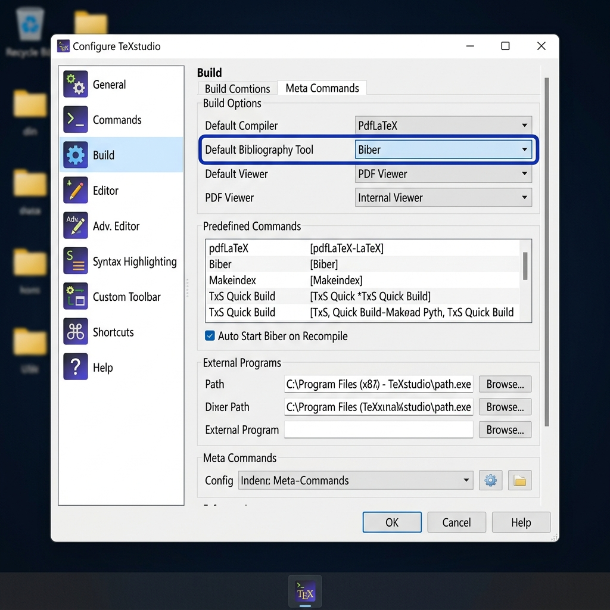
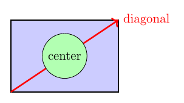
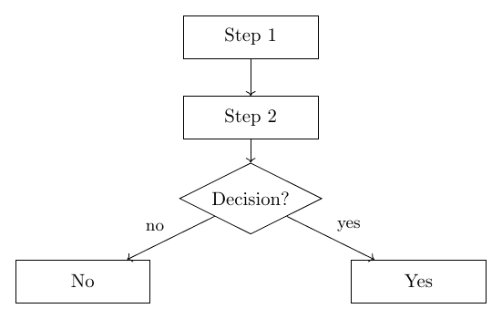
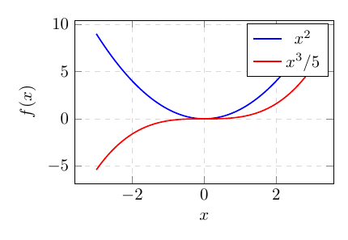
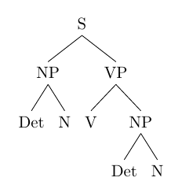
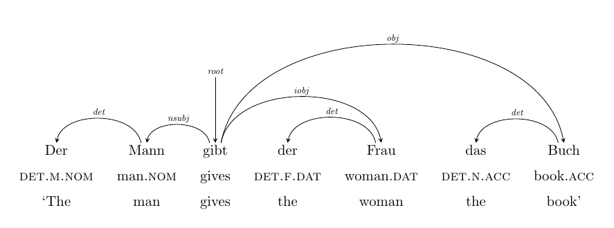

## Overview

Building on Session 1, this session covers:

- **Longer documents** — multi-file project structure for theses and dissertations
- **Bibliography management** — `.bib` files, `biblatex`, and citation commands
- **Zotero + BetterBibTeX** — reference management with continuous auto-export
- **Quarto** — literate programming combining R/Python code with LaTeX output
- **TikZ** — programmatic figures and diagrams written directly in LaTeX
- **Templates** — journal submission files and university thesis templates
- **Debugging** — reading error messages and fixing common problems

::: {.callout-tip}
**Prerequisites:** familiarity with LaTeX document structure, basic commands, and environments from Session 1.
:::


## Session 1 Recap {.smaller}

| Concept | Key points |
|---|---|
| Document structure | Preamble + body; `\documentclass`, `\usepackage` |
| Commands | `\command[opt]{arg}` — backslash notation |
| Environments | `\begin{name}` … `\end{name}` blocks |
| Text formatting | `\textbf`, `\textit`, `\section`, `\itemize` |
| Math | `$...$` inline; `\[...\]` display; `equation` for numbered |
| Figures and tables | `figure` and `table` float environments with `\label`/`\ref` |
| Distributions | TeX Live (recommended); MiKTeX; TinyTeX |
| Editors | Overleaf, Prism, TeXlyre, TeXstudio, VS Code |


## Document Classes for Longer Works {.smaller}

For documents longer than a typical journal article, choose the right `\documentclass`:

| Class | Use for | Key structure commands |
|---|---|---|
| `article` | Papers, short reports | `\section`, `\subsection` |
| `report` | Bachelor/master theses, technical reports | `\chapter`, `\section` |
| `book` | PhD theses, monographs | `\part`, `\chapter`, `\section` |
| `beamer` | Presentations | `\frame`, `\begin{block}` |

Most universities provide a custom class (e.g. `unikoeln-thesis`) that presets all formatting.

**Useful preamble options for longer documents:**

```latex
\documentclass[12pt, a4paper, twoside, openright]{report}
\usepackage{hyperref}     % clickable cross-references and PDF metadata
\usepackage{cleveref}     % smart refs: \cref{fig:x} → "Figure 1"
\usepackage{microtype}    % improved line breaking and spacing
\usepackage{setspace}     % line spacing (\onehalfspacing, \doublespacing)
```


## Multi-file Projects: `\input` and `\include` {.smaller}

For long documents, split your `.tex` source into multiple files.

**`\input{filename}` — inline inclusion:**

```latex
% main.tex
\documentclass{report}
\begin{document}
\input{chapters/introduction}
\input{chapters/methods}
\input{chapters/results}
\end{document}
```

- Inserts the file content directly — equivalent to copy-pasting
- Can be nested; no page break is forced

**`\include{filename}` — chapter inclusion with page break:**

```latex
\include{chapters/introduction}  % forces a new page before and after
```

- Supports `\includeonly{chapter1,chapter3}` to compile only selected chapters — faster iteration on large documents

::: {.callout-note}
Use `\input` for small fragments (preamble settings, custom commands). Use `\include` for major structural divisions like chapters.
:::


## Recommended Thesis Folder Structure

```
my-thesis/
├── main.tex              ← root document
├── preamble.tex          ← packages and settings (\input'd)
├── chapters/
│   ├── 01-introduction.tex
│   ├── 02-methods.tex
│   ├── 03-results.tex
│   └── 04-discussion.tex
├── appendices/
│   └── appendix-a.tex
├── figures/
│   ├── fig-methods.pdf
│   └── fig-results.pdf
├── references.bib        ← bibliography database
└── output/
    └── thesis.pdf
```

**Keep figures as vector PDFs** — they scale perfectly at any zoom level and stay sharp in print.

::: {.callout-tip}
Put this folder in a Git repository from day one. Version control for a thesis is invaluable — you can always go back to an earlier version.
:::


## LaTeX Engines {.smaller}

A **LaTeX engine** is the program that reads your `.tex` file and produces output. Several exist — choose based on your font and language needs:

| Engine (since) | Output | Unicode | System fonts | When to use |
|---|---|---|---|---|
| `pdflatex` (1997) | PDF directly | Partial (Latin extended) | No — TeX fonts only | Most journal templates; fastest compile; widest compatibility |
| `xelatex` (2004) | PDF via XDV | Full UTF-8 | Yes — any installed font | Non-Latin scripts; custom OpenType/TrueType fonts; multilingual documents |
| `lualatex` (2007) | PDF directly | Full UTF-8 | Yes — via `fontspec` | Same as XeLaTeX + Lua scripting for advanced customisation; slower compile |
| `latex` + `dvipdf` (1985) | DVI → PDF | No | No | Legacy workflows; rarely needed today |

**Browser-based engines (no installation):**

| Engine | How it works | Use case |
|---|---|---|
| **SwiftLaTeX** (2019) | Compiles entirely in the browser via WebAssembly; no server round-trip | Offline-capable web apps; embedding LaTeX in tools |
| **BusyTeX** (2022) | TeX Live compiled to WASM; runs `pdflatex`/`xelatex` client-side | Self-contained browser editors; privacy-sensitive workflows |

::: {.callout-tip}
For new documents: use `pdflatex` if the journal template requires it, otherwise `lualatex` for the most modern and flexible setup. Overleaf, Prism, and TeXlyre all support switching engines in project settings.
:::


## Bibliography: How It Works {.smaller}

LaTeX separates the bibliography **database** (a `.bib` file) from the **formatting style** (applied at compile time).

**Why multiple compilation passes?**

Each pass does something different:

```
pdflatex main.tex   → compiles document; writes citation keys to main.aux
biber main          → reads main.aux; looks up keys in main.bib;
                      writes formatted bibliography to main.bbl
pdflatex main.tex   → reads main.bbl; inserts bibliography into PDF
pdflatex main.tex   → resolves all cross-references (page numbers, labels)
```

Skipping passes is the most common reason references show as **[?]** or the bibliography is missing entirely.

**Choose your backend:**

| Backend (since) | Style package | When to use |
|---|---|---|
| `biber` (2011) | `biblatex` | **New projects and theses** — full Unicode support; per-entry-type formatting; advanced sorting and filtering; large choice of maintained styles (APA, Chicago, linguistics-specific) |
| `BibTeX` (1985) | `natbib` | **Publisher-mandated** — ACM, IEEE, Elsevier, Springer templates ship custom `.bst` files that require BibTeX directly; ASCII cite keys only; less flexible but universally supported |
| `BibTeX` | `biblatex` | **Compatibility fallback** — set `backend=bibtex` in the preamble when `biber` is unavailable (e.g. restricted servers or CI); retains `biblatex` syntax but loses Unicode sorting and some advanced features |

::: {.callout-note}
`biber` and `BibTeX` are **not interchangeable** — the package loaded in the preamble must match what the editor runs. Using `backend=biber` with the BibTeX executable (or vice versa) produces errors.
:::

**Minimum `biblatex` setup:**

```latex
\usepackage[backend=biber, style=apa]{biblatex}
\addbibresource{references.bib}
...
\printbibliography
```


## Configuring TeXstudio for Biber {.smaller}

TeXstudio defaults to **BibTeX** as the bibliography tool. When your document uses `biblatex` with `backend=biber`, you must change this setting — otherwise you get errors like:

```
I found no \citation commands---while reading file test.aux
I found no \bibdata command---while reading file test.aux
I found no \bibstyle command---while reading file test.aux
```

**Fix:**

**Options → Configure TeXstudio → Build → Default Bibliography Tool → `Biber`**

{width=60%}

**After changing the setting — compile in order:**

1. **PDFLaTeX** (F6) — generates `.aux` with citation keys
2. **Bibliography / Biber** (F8) — processes `.bib`, writes `.bbl`
3. **PDFLaTeX** (F6) — inserts bibliography
4. **PDFLaTeX** (F6) — resolves page numbers and cross-references

Or press **F5 (Build & View)** — TeXstudio runs the full sequence automatically.

::: {.callout-tip}
`latexmk` (used by VS Code LaTeX Workshop and Overleaf) detects `biber` automatically from the preamble and runs the correct sequence without any configuration.
:::


## The `.bib` File {.smaller}

A `.bib` file is a plain-text database of references. Each entry has a **type**, a **cite key**, and **fields**:

```bibtex
@article{schepens2024prominence,
  author    = {Schepens, Job and Smith, Anna},
  title     = {Prominence in Language},
  journal   = {Language and Cognition},
  year      = {2024},
  volume    = {16},
  pages     = {123--145},
  doi       = {10.1017/langcog.2024.12},
}

@book{chomsky1965aspects,
  author    = {Chomsky, Noam},
  title     = {Aspects of the Theory of Syntax},
  publisher = {MIT Press},
  address   = {Cambridge, MA},
  year      = {1965},
}
```

Common entry types: `@article`, `@book`, `@incollection`, `@inproceedings`, `@phdthesis`, `@misc`

::: {.callout-note}
The cite key (e.g. `schepens2024prominence`) is what you use in `\cite{...}` commands. BetterBibTeX generates these automatically from Zotero.
:::


## Zotero: Building Your Reference Library {.smaller}

[**Zotero**](https://www.zotero.org) is a free, open-source reference manager widely used in academia.

**Collecting references:**

- **Browser connector** imports references from publisher websites, Google Scholar, PubMed with one click
- Drag-and-drop PDFs → Zotero extracts metadata automatically
- Add by DOI, ISBN, or arXiv ID directly

**Organising your library:**

- Collections and sub-collections (like folders)
- Tags for thematic grouping; related items for linking connected works

**Generating citations:**

- Word processor plugins (Word, LibreOffice) for inline citations
- Supports thousands of citation styles (APA, MLA, Chicago, linguistics styles …)

| | |
|---|---|
| Download | [zotero.org](https://www.zotero.org) |
| Browser connector | [zotero.org/download/connectors](https://www.zotero.org/download/connectors) |

::: {.callout-tip}
Overleaf, Prism (OpenAI), and TeXlyre all include Zotero integration panels for searching and importing references directly within the editor.
:::


## BetterBibTeX: Continuous Auto-export {.smaller}

[**BetterBibTeX**](https://retorque.re/zotero-better-bibtex/) (BBT) is a Zotero plugin that connects your Zotero library directly to your LaTeX project.

**Install:** Zotero → Tools → Plugins → Install from file (download `.xpi` from [retorque.re/zotero-better-bibtex](https://retorque.re/zotero-better-bibtex/))

**Cite keys:**

BBT generates a stable, customisable cite key for every item:

- Default pattern: `[auth:lower][year][veryshorttitle]` → `schepens2024prominence`
- Configure globally: Preferences → Better BibTeX → Citation Keys
- Pin individual keys to prevent them from changing

**Setting up auto-export — set it and forget it:**

1. Right-click a Zotero collection → **Export Collection…**
2. Format: **Better BibLaTeX** (or Better BibTeX)
3. Check **Keep updated**
4. Save as `references.bib` in your LaTeX project folder

::: {.callout-tip}
With **Keep updated** enabled, every time you add, edit, or delete a reference in Zotero, the `.bib` file regenerates automatically. Your LaTeX project always has fresh, correct references — no manual exports needed.
:::


## Citation Commands in `biblatex` {.smaller}

With `\usepackage[backend=biber, style=apa]{biblatex}` and `\addbibresource{references.bib}`:

| Command | Output |
|---|---|
| `\cite{key}` | (Author, Year) |
| `\parencite{key}` | (Author, Year) — parenthetical |
| `\textcite{key}` | Author (Year) — narrative |
| `\autocite{key}` | Style-determined; adapts to context |
| `\cites{key1}{key2}` | Multiple citations |
| `\footcite{key}` | Footnote citation |

**Example text:**

```latex
\textcite{schepens2024prominence} argue that prominence is cross-linguistic.
Several studies support this claim \parencite{chomsky1965aspects, schepens2024prominence}.
```

**Print the bibliography:**

```latex
\printbibliography                        % full bibliography
\printbibliography[heading=bibintoc]      % include in table of contents
\printbibliography[type=article]          % filter by entry type
```


## Quarto: Literate Programming Meets LaTeX {.smaller}

[**Quarto**](https://quarto.org) is a scientific publishing system that produces PDF output via LaTeX while keeping analysis code and prose in a single source file.

**A Quarto document (`.qmd`):**

````markdown
---
title: "My Analysis"
format: pdf
---

## Introduction

We analysed **N = 42** participants.

```{{r}}
#| label: fig-histogram
#| fig-cap: "Distribution of scores"
hist(rnorm(100))
```

As shown in @fig-histogram, scores are normally distributed.
````

- Write in **Markdown** (with LaTeX commands where needed)
- Embed **R, Python, or Julia** code chunks — output appears in the compiled PDF
- Cross-references (`@fig-histogram`), citations (`@key`), and equations all work out of the box

::: {.callout-note}
Quarto is the successor to R Markdown. It supports multiple languages and output formats (PDF, HTML, DOCX, slides) from the same source file.
:::


## Quarto PDF Output and LaTeX Options {.smaller}

Quarto converts `.qmd` → LaTeX → PDF via a TeX Live installation.

**Configure LaTeX in the YAML header:**

```yaml
---
title: "Thesis Chapter"
format:
  pdf:
    documentclass: report
    papersize: a4
    fontsize: 12pt
    geometry: margin=2.5cm
    keep-tex: true          # inspect the generated .tex file
    include-in-header: preamble.tex   # your custom packages
    cite-method: biblatex
    bibliography: references.bib
    biblio-style: apa
---
```

**Why `keep-tex: true`?**

- Lets you inspect and modify the generated LaTeX if something doesn't look right
- Some journals require a `.tex` submission file — Quarto can generate it

::: {.callout-tip}
Install Quarto from [quarto.org/docs/get-started](https://quarto.org/docs/get-started/). With TinyTeX (`tinytex::install_tinytex()` in R), PDF output works immediately — no separate TeX Live install needed.
:::


## Writing a Complete Thesis in Quarto {.smaller}

Quarto supports **multi-file book projects** — the natural structure for a thesis.

**Initialise a Quarto book:**

```bash
quarto create project book my-thesis
```

This generates a ready-to-use folder:

```
my-thesis/
├── _quarto.yml        ← project config: title, author, chapters, output
├── index.qmd          ← front matter / preface
├── chapters/
│   ├── 01-introduction.qmd
│   ├── 02-methods.qmd
│   ├── 03-results.qmd
│   └── 04-discussion.qmd
├── references.bib
└── _extensions/       ← optional: university theme extension
```

**`_quarto.yml` for a PDF thesis:**

```yaml
project:
  type: book

book:
  title: "My Thesis Title"
  author: "Your Name"
  date: "2026"
  chapters:
    - index.qmd
    - chapters/01-introduction.qmd
    - chapters/02-methods.qmd
    - chapters/03-results.qmd
    - chapters/04-discussion.qmd

bibliography: references.bib

format:
  pdf:
    documentclass: report
    papersize: a4
    fontsize: 12pt
    geometry: margin=2.5cm
    toc: true
    number-sections: true
    cite-method: biblatex
    biblio-style: apa
    include-in-header: preamble.tex   # custom LaTeX packages
```

**Render the whole thesis:**

```bash
quarto render          # builds PDF (and HTML if configured)
quarto render --to pdf # PDF only
```

::: {.callout-tip}
Each `.qmd` chapter file is an ordinary Quarto document — it can contain R/Python code chunks, figures, tables, and equations. Cross-references (`@fig-`, `@tbl-`, `@sec-`) resolve across chapter boundaries automatically.
:::

::: {.callout-note}
Quarto book projects also render to HTML (a website) and EPUB from the same source. Useful for sharing a web version alongside the submitted PDF.
:::


## TikZ: Programmatic Figures {.smaller}

[**TikZ**](https://ctan.org/pkg/pgf) ("TikZ ist kein Zeichenprogramm") is a LaTeX package for creating figures programmatically — directly in your `.tex` source.

**Why TikZ?**

- Figures are plain text — version-controlled alongside your paper
- Perfect vector output at any scale
- Consistent fonts and styling with the surrounding document
- Highly precise control over every element

**Minimal setup:**

```latex
\usepackage{tikz}
\usetikzlibrary{arrows.meta, positioning}  % load useful libraries
```

**Drawing shapes and paths:**

:::: {.columns}
::: {.column width="55%"}
```latex
\begin{tikzpicture}
  \draw[thick, fill=blue!20] (0,0) rectangle (3,2);
  \draw[red, ->, line width=1.2pt] (0,0) -- (3,2) node[right] {diagonal};
  \node[circle, draw, fill=green!30, minimum size=1cm] at (1.5,1) {center};
\end{tikzpicture}
```
:::
::: {.column width="45%"}
{width=100%}
:::
::::

::: {.callout-note}
TikZ has a steep learning curve. [tikz.dev](https://tikz.dev) and the PGF/TikZ manual on CTAN are comprehensive references. Start small and build up.
:::


## TikZ: Flowcharts {.smaller}

:::: {.columns}
::: {.column width="55%"}
```latex
\usetikzlibrary{shapes.geometric, arrows.meta, positioning}
\begin{tikzpicture}[
  node distance=1.5cm,
  box/.style={draw, rectangle, minimum width=2.5cm,
              minimum height=0.8cm, align=center},
  decnode/.style={draw, diamond, aspect=2,
                  minimum width=2.5cm, align=center}
]
  \node[box] (A) {Step 1};
  \node[box, below of=A] (B) {Step 2};
  \node[decnode, below of=B] (C) {Decision?};
  \node[box, below right=0.8cm and 1.2cm of C] (D) {Yes};
  \node[box, below left=0.8cm and 1.2cm of C] (E) {No};
  \draw[->] (A) -- (B);
  \draw[->] (B) -- (C);
  \draw[->] (C) -- node[above right, font=\small] {yes} (D);
  \draw[->] (C) -- node[above left, font=\small] {no} (E);
\end{tikzpicture}
```
:::
::: {.column width="45%"}
{width=100%}
:::
::::

Named styles keep the node definitions clean and reusable. The `decnode` style uses TikZ's built-in `diamond` shape from `shapes.geometric`.


## TikZ: Plots with PGFPlots {.smaller}

:::: {.columns}
::: {.column width="55%"}
```latex
\usepackage{pgfplots}
\pgfplotsset{compat=1.18}
\begin{tikzpicture}
  \begin{axis}[
    xlabel={$x$}, ylabel={$f(x)$},
    grid=major, grid style={dashed, gray!30}
  ]
    \addplot[blue, thick, domain=-3:3, samples=60]{x^2};
    \addlegendentry{$x^2$}
    \addplot[red, thick, domain=-3:3, samples=60]{x^3/5};
    \addlegendentry{$x^3/5$}
  \end{axis}
\end{tikzpicture}
```
:::
::: {.column width="45%"}
{width=100%}
:::
::::

PGFPlots can also read data from CSV files (`\addplot table {data.csv}`), making it suitable for publication-quality plots directly from experimental data.


## TikZ: Syntax Trees {.smaller}

:::: {.columns}
::: {.column width="55%"}
```latex
\usepackage{tikz-qtree}
\begin{tikzpicture}
  \Tree [.S
          [.NP Det N ]
          [.VP V
            [.NP Det N ]
          ]
        ]
\end{tikzpicture}
```
:::
::: {.column width="45%"}
{width=100%}
:::
::::

`tikz-qtree` uses a compact bracket notation. For more control (node styles, movement arrows, coindexation), use the full `tikz` library directly or `forest` — a popular alternative for complex phrase structure trees.


## TikZ: Dependency Graphs and Glosses {.smaller}

The `tikz-dependency` package draws dependency arcs over interlinear glossed text — standard in typological and computational linguistics:

:::: {.columns}
::: {.column width="60%"}
```latex
\usepackage{tikz-dependency}

\begin{dependency}[theme=simple,
    label style={above, font=\small\itshape}]
  \begin{deptext}[column sep=1.2em]
    Der \& Mann \& gibt \& der \& Frau \& das \& Buch \\
    \textsc{det.m.nom} \& man.\textsc{nom} \& gives \&
      \textsc{det.f.dat} \& woman.\textsc{dat} \&
      \textsc{det.n.acc} \& book.\textsc{acc} \\
    `The \& man \& gives \& the \& woman \& the \& book' \\
  \end{deptext}
  \deproot{3}{root}
  \depedge{3}{2}{nsubj}
  \depedge{3}{5}{iobj}
  \depedge{3}{7}{obj}
  \depedge{2}{1}{det}
  \depedge{5}{4}{det}
  \depedge{7}{6}{det}
\end{dependency}
```
:::
::: {.column width="40%"}
{width=100%}
:::
::::

::: {.callout-tip}
For complex figures, consider generating them in Python (`matplotlib` PGF backend) or R (`tikzDevice`) and importing the resulting `.tex` fragment.
:::


## LaTeX for Linguistics {.smaller}

:::: {.columns}
::: {.column width="50%"}
**Interlinear glosses — `gb4e`:**

```latex
\usepackage{gb4e}

\begin{exe}
  \ex
  \gll Der Mann sieht die Frau. \\
       the.M man sees the.F woman \\
  \trans `The man sees the woman.'
\end{exe}
```

Uses Leipzig Glossing Rules abbreviations (`\textsc{nom}`, `\textsc{acc}` etc.).
Alternative packages: `linguex`, `expex`.

**IPA symbols — Unicode + `fontspec` (XeLaTeX/LuaLaTeX):**

```latex
% Preamble:
\usepackage{fontspec}
\setmainfont{Charis SIL}  % or Doulos SIL, Gentium

% In text — type Unicode directly:
The vowel /ɪ/ contrasts with /iː/ in English.
The fricatives [ɸ β] are bilabial.
```

Alternative for `pdflatex`: `\usepackage{tipa}` with custom commands (`\textipa{...}`), but Unicode input is simpler with a modern engine.

:::
::: {.column width="50%"}
**Optimality Theory tableaux — `ot-tableau`:**

```latex
\usepackage{ot-tableau}

\begin{tableau}{c:c|c}
\inp{\ipa{/inp/}}  \const{C1} \const{C2} \const{C3}
\cand{[cand1]}               \vio{*}
\cand[\HandRight]{[cand2]}             \vio{*}
\cand{[cand3]}     \vio{*!}
\end{tableau}
```

**Feature structures / AVMs — `avm`:**

```latex
\usepackage{avm}

\[
\avmbox{NP}
\begin{avm}
  \[ cat & np \\
     agr & \[ num & sg \\
              per & 3rd \] \]
\end{avm}
\]
```

**Semantics — lambda expressions in math mode:**

```latex
% No special package needed:
$\lambda x . \lambda e . \text{run}'(e, x)$

$\llbracket \text{runs} \rrbracket =
  \lambda x \in D_e . \lambda e \in D_v .
  \text{run}(e, x) = 1$
% \llbracket needs: \usepackage{stmaryrd}
```

:::
::::

::: {.callout-tip}
For the `\llbracket`/`\rrbracket` double-bracket notation common in formal semantics, load `\usepackage{stmaryrd}`. For full Unicode IPA input, compile with `lualatex` or `xelatex` and a suitable font such as Charis SIL or Gentium Plus.
:::


## Templates: Journals and Theses {.smaller}

**Journal templates** provide `.cls` and `.sty` files that enforce house style:

| Source | What you get |
|---|---|
| [Overleaf Gallery — Journals](https://www.overleaf.com/gallery/tagged/academic-journal) | Templates for hundreds of journals |
| Publisher websites | ACL, IEEE, Springer, Elsevier all provide LaTeX kits |
| CTAN journal classes | `elsarticle`, `acmart`, `IEEEtran` and many more |

**Thesis templates:**

| Source | Link |
|---|---|
| Overleaf Thesis Gallery | [overleaf.com/gallery/tagged/thesis](https://www.overleaf.com/gallery/tagged/thesis) |
| Universität zu Köln | Check your faculty's doctoral office for approved templates |
| GitHub | Search `latex thesis template <university>` |

**Starting from a template:**

1. Download the template folder
2. Fill in `main.tex`; delete the placeholder content
3. Point `\addbibresource` to your Zotero-exported `.bib` file
4. Compile and iteratively fix errors


## Debugging LaTeX: Reading Error Messages {.smaller}

LaTeX error messages appear in the log file. The key pattern:

```
! LaTeX Error: File `missfont.fd' not found.
l.42 \begin{document}
```

- `!` marks the error type
- The next line describes the problem
- `l.42` tells you the source line where LaTeX stopped

**Common errors and fixes:**

| Error | Likely cause | Fix |
|---|---|---|
| `Undefined control sequence` | Typo in command or missing package | Check spelling; add the right `\usepackage` |
| `Missing $ inserted` | Math symbol outside math mode | Wrap in `$...$` |
| `File not found` | Missing image or `.bib` file | Check filename and path |
| `Runaway argument` | Unclosed `{` brace | Count `{` and `}` carefully |
| `Too many }'s` | Extra closing brace | Remove the extra `}` |

::: {.callout-tip}
Compile often — catching one error at a time is much easier than debugging 20 at once. Search the error message on [tex.stackexchange.com](https://tex.stackexchange.com) — most errors are already answered there.
:::


## Summary

:::: {.columns}
::: {.column}
**Document organisation**

- `report`/`book` class for long documents
- `\input` / `\include` for multi-file projects
- Recommended folder structure for theses

**Bibliography workflow**

- Zotero collects and organises references
- BetterBibTeX auto-exports a continuously updated `.bib` file
- `biblatex` + `biber` for modern citation management
:::
::: {.column}
**Advanced tools**

- **Quarto** — analysis + prose in one file; PDF via LaTeX
- **TikZ** — programmatic vector figures in LaTeX
- **Templates** — start from a journal or thesis template

**Debugging**

- Read the error message and the line number
- Compile often; fix one error at a time

::: {.callout-note .smaller}
All materials: [dkz2r.de/tags/latex](https://www.dkz2r.de/tags/latex/)
:::
:::
::::


## Resources

- [lshort — The Not So Short Introduction to LaTeX](https://www.ctan.org/pkg/lshort)
- [Zotero — Reference Manager](https://www.zotero.org)
- [BetterBibTeX for Zotero](https://retorque.re/zotero-better-bibtex/)
- [biblatex documentation (CTAN)](https://ctan.org/pkg/biblatex)
- [Quarto — Scientific Publishing](https://quarto.org)
- [TikZ & PGF documentation](https://ctan.org/pkg/pgf)
- [tikz.dev — TikZ reference](https://tikz.dev)
- [PGFPlots — plots in LaTeX](https://ctan.org/pkg/pgfplots)
- [Overleaf — Collaborative LaTeX Editor](https://www.overleaf.com)
- [Overleaf thesis templates](https://www.overleaf.com/gallery/tagged/thesis)
- [DKZ.2R: LaTeX for Novices — Academic Publishing](https://dkz2r.github.io/latex-novice-academic-publishing/)
- [Prism — OpenAI's AI-native LaTeX workspace](https://prism.openai.com)
- [TeXlyre — Open-source, local-first LaTeX editor](https://texlyre.github.io/texlyre/)
- [tex.stackexchange.com](https://tex.stackexchange.com)
